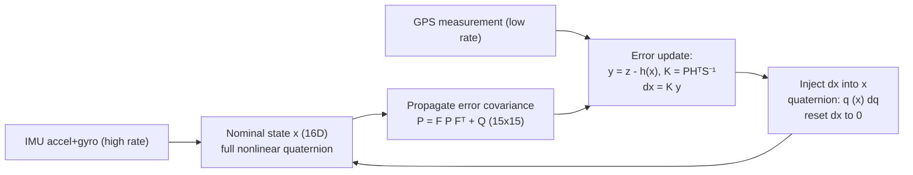
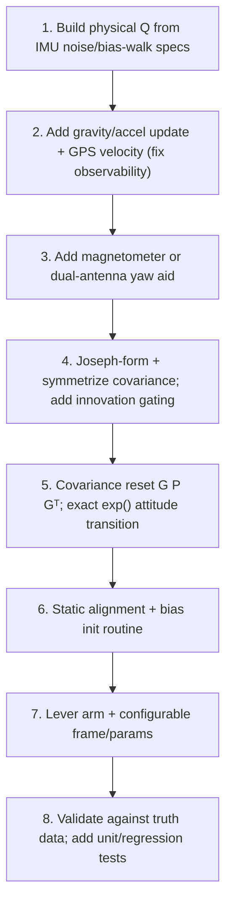

# Error-State Extended Kalman Filter (ES-EKF)

This document describes the Error-State EKF (also called the Multiplicative EKF, MEKF)
implemented in `src/es_ekf/` and the rocket INS model in
`src/models/full_state_esekf.rs`. It covers the theory, the math, how the code maps
to that math, how to run it, and the current limitations / roadmap.

For the classic (Euler-angle) EKF, see the main [README](README.md).

---

## 1. Why an error-state filter?

The standard EKF stores attitude as three Euler angles, which has two problems:

- **Singularities (gimbal lock)**: Euler kinematics contain `tan(theta)` and
  `1/cos(theta)`, which blow up at `theta = +/-90deg`.
- **Quaternions cannot be added**: a quaternion has 4 numbers but only 3 degrees of
  freedom (the unit-norm constraint removes one). Putting a quaternion directly in the
  EKF state and doing `x + K*y` breaks unit-norm, and the 4x4 attitude covariance
  becomes singular.

The ES-EKF splits the state into two pieces:

- **Nominal state** `x` (16D): `[p, v, q, a_b, w_b]`. Integrated at high rate straight
  from the IMU. Carries the full nonlinear quaternion. Has no covariance of its own.
- **Error state** `dx` (15D): `[dp, dv, dtheta, da_b, dw_b]`. The small deviation of the
  true state from the nominal. The Kalman filter runs on the error state. Attitude
  error `dtheta` is a **3-DOF rotation vector** (minimal, no singularity, always small),
  which is why `P` is 15x15 rather than 16x16.

The true state is `x_true = x_nominal (+) dx`, where for the quaternion the "(+)" is a
**multiplicative** correction `q_true = q_nom (x) dq`, with `dq ~= [1, 0.5*dtheta]`.



---

## 2. State layout

| Block        | Nominal `x` (16D) | Error `dx` (15D) |
|--------------|-------------------|------------------|
| Position     | `0..3`            | `0..3`           |
| Velocity     | `3..6`            | `3..6`           |
| Attitude     | quaternion `6..10` (w,x,y,z) | `dtheta` `6..9` |
| Accel bias   | `10..13`          | `9..12`          |
| Gyro bias    | `13..16`          | `12..15`         |

The quaternion occupies 4 slots in the nominal state but only 3 (`dtheta`) in the error
state. `inject_error` maps the 15D error back onto the 16D nominal (see below).

---

## 3. The math and its code mapping

The filter lives in [`src/es_ekf/filter.rs`](src/es_ekf/filter.rs); the model in
[`src/models/full_state_esekf.rs`](src/models/full_state_esekf.rs).

### 3.1 Predict (fast IMU loop) — `predict(imu, dt)`

1. **Nominal propagation** (`nominal_prediction`), Z-up world frame:

   ```
   a_body  = a_measured - a_bias
   w_body  = w_measured - w_bias
   a_world = R(q) * a_body - g          , g = [0, 0, 9.81]
   p_next  = p + v*dt + 0.5*a_world*dt^2
   v_next  = v + a_world*dt
   q_next  = q (x) dq(w_body*dt)         (exact axis-angle integration)
   ```

2. **Error-covariance propagation**: `P = F P Fᵀ + Q`, with the 15x15 error-state
   transition Jacobian `F = I + A*dt` (Sola convention, `R` = body->world). Nonzero
   off-identity blocks (`error_transition_jacobian`):

   ```
   F[dp,     dv]     =  I * dt
   F[dv,     dtheta] = -R * skew(a_body) * dt
   F[dv,     da_b]   = -R * dt
   F[dtheta, dtheta] =  I - skew(w_body) * dt
   F[dtheta, dw_b]   = -I * dt
   ```

   The mean error is not propagated: it stays 0 because the nominal absorbs it.

### 3.2 Update (slow GPS loop) — `update(z, R)`

```
y = z - h(x_nom)          # innovation, h = position (measurement_prediction)
S = H P Hᵀ + R            # innovation covariance
K = P Hᵀ S^-1             # Kalman gain
dx = K y                  # ERROR estimate (not a new state)
```

`H` (`measurement_jacobian`) is the Jacobian of `h` **with respect to the error state**;
for GPS position it is `[I3 | 0]` (3x15).

### 3.3 Inject + reset — `inject_error(x_nom, dx)`

```
p, v, biases : added directly
q_corrected  = q_nom (x) dq,  dq = normalize([1, 0.5*dtheta])
```

After injection the error state is implicitly reset to 0 (the nominal now contains it).
This multiplicative step is what keeps the quaternion unit-norm.

---

## 4. Usage

`RocketESEKF` is the convenience alias for
`ErrorStateKalmanFilter<RocketState>`.

```rust
use rust_ekf::{RocketESEKF, RocketState};
use ndarray::{array, Array1, Array2};

// Nominal state (16D): [p, v, q(w,x,y,z), a_bias, w_bias]. Identity quaternion.
let mut initial_state = Array1::<f64>::zeros(16);
initial_state[6] = 1.0; // qw

let initial_p = Array2::<f64>::eye(15) * 0.01; // error covariance P (15x15)
let q         = Array2::<f64>::eye(15) * 1e-4; // process noise Q (15x15)

let mut ekf = RocketESEKF::new(initial_state, initial_p, q, RocketState);

// Fast loop: integrate the IMU every step.
let imu = [ax, ay, az, gx, gy, gz]; // accel (m/s^2), gyro (rad/s)
ekf.predict(&imu, dt);

// Slow loop: fuse a GPS position fix when available.
let gps = array![px, py, pz];
let r   = Array2::<f64>::eye(3) * 1.0;   // GPS measurement noise
ekf.update(&gps, &r);

// Read results.
let x = &ekf.nominal_state;               // 16D
let (px, py, pz) = (x[0], x[1], x[2]);
let (qw, qx, qy, qz) = (x[6], x[7], x[8], x[9]);
```

A runnable smoke test lives at [`src/testing/esekf_test.rs`](src/testing/esekf_test.rs)
(binary `esekf_test`). It drives the fast loop from the IMU columns of
`flight_data.csv` and injects a synthetic GPS position on a slow cadence. It only proves
the code path is stable (finite, no panic) — the CSV has no real position data, so the
numeric trajectory is not meaningful.

```bash
cargo run --bin esekf_test
```

---

## 5. Limitations (current state)

**Modeling**

- `F` uses first-order Euler discretization (`F = I + A*dt`); the attitude block is
  `I - skew(w)*dt` rather than the exact `exp(-[w]x*dt)`. Fine at 100 Hz / small
  rotations, approximate at high spin rates.
- Process noise `Q` is added raw (`TODO(process-noise)` in `filter.rs`), not derived
  from IMU noise spectral densities and bias random walk, and not scaled by `dt`.
- No post-injection covariance reset `P <- G P Gᵀ` (`TODO(covariance-reset)`).
- **Position-only GPS** means weak observability: yaw about gravity is unobservable
  (no magnetometer / dual antenna), and roll/pitch/accel-bias are only observable during
  maneuvers. No gravity/accelerometer or GPS-velocity update.
- GPS antenna assumed at the IMU origin (`TODO(lever-arm)`).
- Gravity and frame (`Z-up`, `g = 9.81`) are hardcoded; `RocketState` is not
  configurable.

**Numerical / software**

- Covariance update is the simple `(I - KH)P` form, not Joseph-stabilized, and is not
  re-symmetrized; can lose positive-definiteness over long runs.
- No innovation / chi-square gating for outlier rejection (only a singular-`S`
  fallback).
- No initialization / static alignment routine (initial attitude = identity, biases = 0).

**Validation**

- No ground-truth position data in `flight_data.csv`, so no accuracy/RMSE evaluation.
- No unit or regression tests (only the manual smoke-test driver).

---

## 6. Roadmap to a full implementation



Priorities 1-2 give the biggest correctness gains (the filter is currently
under-constrained and mistuned); 4-5 harden numerical robustness; 8 is what lets you
trust the output. The `TODO(...)` markers in the source map to steps 1, 5, and 7.

---

## 7. What is still needed to do (checklist)

Concrete, actionable items to take this from "runs without crashing" to a trustworthy
navigation filter. Ordered roughly by impact.

### Correctness / observability (do first)

- [ ] **Physical process noise `Q`.** Replace the raw `eye(15)*1e-4` with a `Q` built
      from IMU datasheet values: accel white noise, gyro white noise, accel-bias random
      walk, gyro-bias random walk; discretize and scale by `dt`. Location:
      `es_ekf/filter.rs` (`TODO(process-noise)`) and the model constructor.
- [ ] **GPS velocity update.** Add a velocity measurement (`H = [0 I3 0 0 0]`) so
      velocity and, through the dynamics, attitude become strongly observable.
- [ ] **Gravity / accelerometer update (or ZUPT).** Use the accel direction as a
      measurement when not maneuvering to make roll/pitch observable at rest.
- [ ] **Yaw aid.** Add a magnetometer (or dual-antenna GPS) measurement; without it,
      heading about gravity is unobservable and will drift.

### Numerical robustness

- [ ] **Joseph-form covariance update** in `es_ekf/filter.rs`:
      `P = (I-KH) P (I-KH)ᵀ + K R Kᵀ`, and re-symmetrize `P <- 0.5*(P + Pᵀ)`.
- [ ] **Innovation / chi-square gating** to reject GPS outliers before applying `K`.
- [ ] **Covariance reset after injection**: `P <- G P Gᵀ` with
      `G = blockdiag(I, I, I - 0.5*skew(dtheta), I, I)` (`TODO(covariance-reset)`).
- [ ] **Exact attitude transition**: replace `I - skew(w)*dt` with `exp(-[w]x*dt)`
      (Rodrigues) in `error_transition_jacobian` for high spin rates.

### Modeling completeness

- [ ] **Lever arm** in `measurement_prediction` / `measurement_jacobian`
      (`p + R*r_arm`, skew block in `H`) — `TODO(lever-arm)`.
- [ ] **Configurable `RocketState`**: make gravity, world frame (Z-up/down), and noise
      parameters constructor arguments instead of hardcoded constants.
- [ ] **Initialization / static alignment**: estimate initial roll/pitch from gravity
      and initial gyro bias from a static average before the run starts.

### Validation

- [ ] **Ground-truth data**: obtain a log with real position (GPS) columns to compute
      accuracy/RMSE; the current `flight_data.csv` has none.
- [ ] **Unit / regression tests**: assert quaternion norm stays 1, verify `F` blocks
      against a numerical Jacobian, and add a known-trajectory regression test.
- [ ] **Real fusion driver**: extend `esekf_test.rs` (or add a new binary) to fuse real
      measurements instead of the synthetic zero-GPS smoke test.

---

## 8. References

- [Joan Sola, "Quaternion kinematics for the error-state Kalman filter"](https://arxiv.org/abs/1711.02508)
- [Wikipedia: Extended Kalman Filter](https://en.wikipedia.org/wiki/Extended_Kalman_filter)
